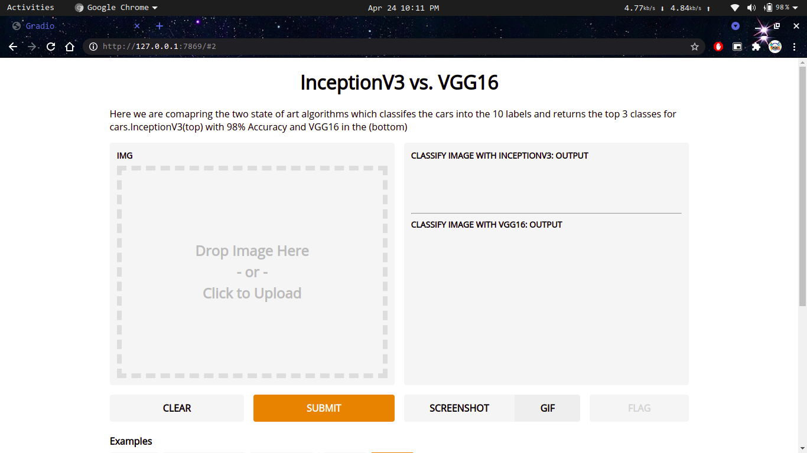
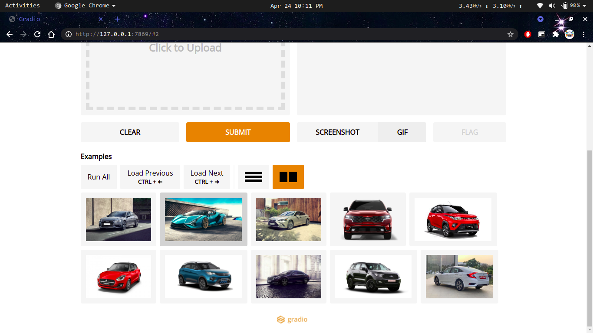

# Car_Brand-Classification
This is a Image Classification Technique and classified with Deep Learning which classifies car which belongs to any of the 10 classes
Those classes are <b>Audi , Lamborghini , Mercedes , KIA , Suzuki , Tata , Ford , Lexus , Honda , Mahindra</b>

All these images are being scped from the web using the simple image download by python

The front end is developed with the help of Gradio which provides an Interface which is readily available for Data Scientists which avoids using HTML,CSS,JavaScript and this is mainly useful for POC purpose and this classification is done using Creating the Architecture from scratch and then shifted to the transfer learning techniques such as InceptionV3 and VGG16 for getting better prediction

The below page is the Front End for the Application which gives us the  predictions for the cars classes

The next image is the continution image here we have the various classes of cars

Now we will test on one of the image and see the prediction from both the Transfer Learning Architectures
The top one is InceptionV3 and the bottom one is the VGG16

Here we ca see that both the architectures gave us the right predictions for the car and there are some errors but these two techniques gives us good performance and also helps us to identify the classes for the cars

<b>Front End Interface</b>

<b>The accuarcies of the models used for classification</b>:  
<b>Base Model</b> ----  <b>91%</b>   
<b>InceptionV3</b>  ----  <b>98%</b>  
<b>VGG16</b>   ----  <b>99%</b>

<b>Deep Learning Framework </b>
