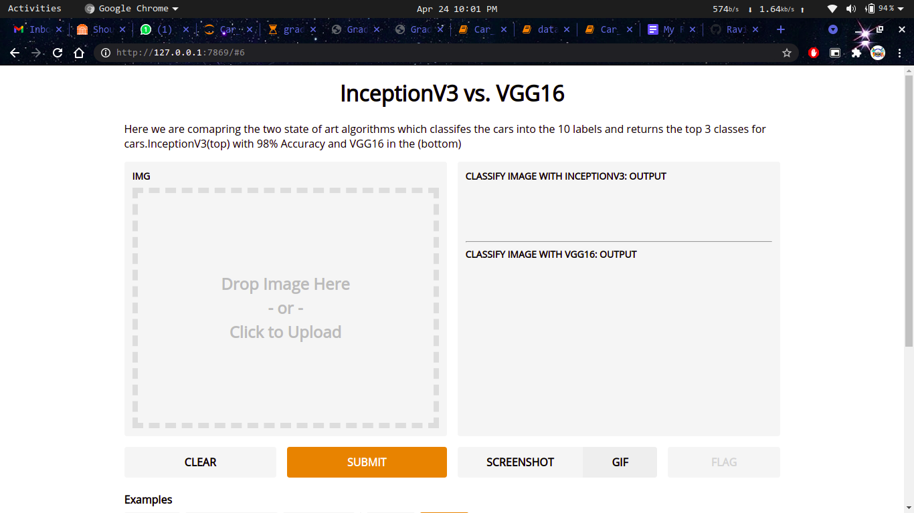

# Car_Brand-Classification
This is a Image Classification Technique and classified with Deep Learning which classifies car which belongs to any of the 10 classes
Those classes are Audi , Lamborghini , Mercedes , KIA , Suzuki , Tata , Ford , Lexus , Honda , Mahindra

All these images are being scped from the web using the simple image download by python

The front end is developed with the help of Gradio which provides an Interface which is readily available for Data Scientists which avoids using HTML,CSS,JavaScript and this is mainly useful for POC purpose and this classification is done using Creating the Architecture from scratch and then shifted to the transfer learning techniques such as InceptionV3 and VGG16 for getting better prediction

The next image

